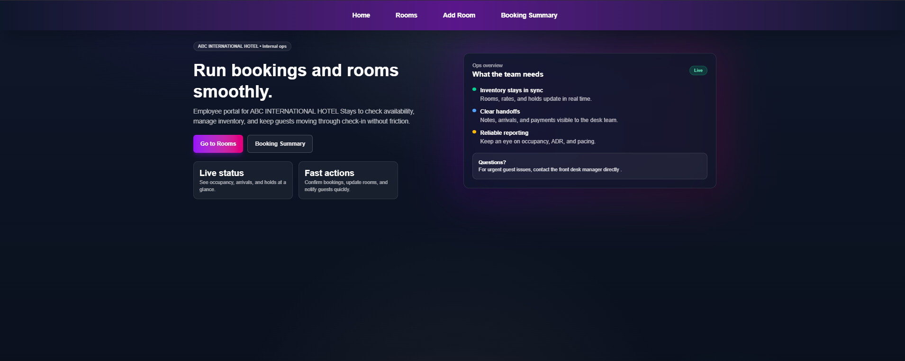
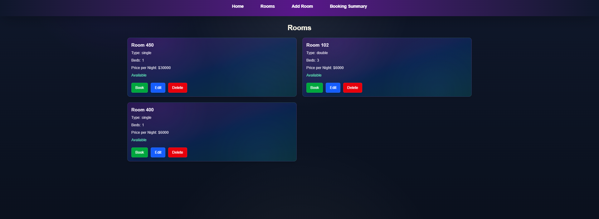
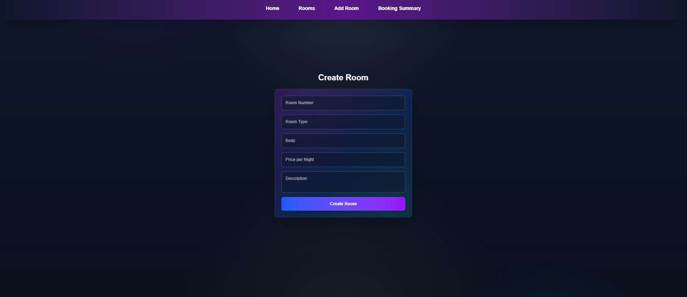
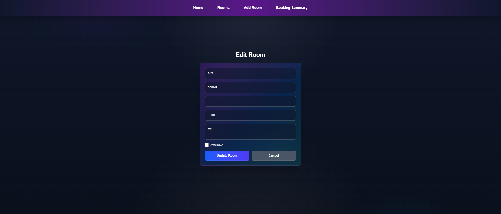

# Hotel Room Booking System

A full-stack hotel room booking application with a Next.js frontend and a Node.js/Express + MongoDB backend. It supports room management, booking creation, and booking summaries, and is ready for deployment with environment-based configuration.

# Features
- View all rooms and details
- Create, edit, and delete rooms
- Book a room and view booking summary
- Responsive design with Tailwind CSS

## Live Links

- Frontend (Render): [https://hotel-room-booking-system-r.onrender.com/]
- Backend (Render): [https://hotel-room-booking-system-380z.onrender.com/api]

## Tech Stack

- Frontend: Next.js (App Router), TypeScript, Tailwind CSS/PostCSS
- Backend: Node.js, Express, TypeScript
- Database: MongoDB (Mongoose)
- Other: Axios, CORS, Dotenv

## Project Structure

```backend/
  src/
    app.ts
    server.ts
    controllers/
      bookingController.ts
      roomController.ts
    models/
      Booking.ts
      Room.ts
    routes/
      bookingRoutes.ts
      roomRoutes.ts
frontend/
  app/
    rooms/
    booking/
    booking-summary/
    create-room/
    edit-room/
    components/
    lib/api.ts
  public/
```

## Setup Instructions

### Prerequisites

- Node.js
- A MongoDB instance

### Backend Setup

1. Install dependencies:

```bash
cd backend
npm install
```

2. Create a `.env` file in `backend/` with:

```bash
MONGO_URI=mongodb_connection_string
PORT=5000
```

3. Run the backend

```bash
npm run build
npm start
```

### Frontend Setup

1. Install dependencies:

```bash
cd ../frontend
npm install
```

2. Create a `.env.local` file in `frontend/` with:

```bash
NEXT_PUBLIC_API_URL=http://localhost:5000
```

3. Run the frontend:

```bash
npm run dev
```

The frontend runs at `http://localhost:3000` by default.

## API Documentation

Base URL: `[LIVE_BACKEND_URL]` (or `http://localhost:5000` in development)

### Rooms

- GET `/api/rooms`
  - Query: `page` (number, optional), `limit` (number, optional)
  - Response: `{ rooms, currentPage, totalPages, totalRooms }`

- GET `/api/rooms/:id`
  - Response: `Room`
  - Errors: `404 Room not found`, `400 Error fetching room`

- POST `/api/rooms`
  - Body: `Room` fields as per model
  - Response: `201 Room`
  - Errors: `400 Error creating room`

- PUT `/api/rooms/:id`
  - Body: Partial `Room` fields
  - Response: `Room`
  - Errors: `400 Error updating room`

- DELETE `/api/rooms/:id`
  - Response: `{ message: "Room deleted" }`
  - Errors: `400 Error deleting room`

### Bookings

- POST `/api/bookings`
  - Body: `{ roomId, guestName, nights, checkInDate }`
  - Behavior: Marks room unavailable upon successful booking
  - Responses:
    - `201 Booking`
    - `400 Room unavailable` or `400 Error booking room`

- GET `/api/bookings/summary`
  - Response: Array of `{ _id, roomNo, type, totalNights }` aggregated by room
  - Errors: `500 Error fetching booking summary`

## Environment Variables

- Backend:
  - `MONGO_URI`: MongoDB connection string
  - `PORT`: Express server port (default 5000)
- Frontend:
  - `NEXT_PUBLIC_API_URL`: Base URL for backend API (used by Axios in `app/lib/api.ts`)

## Deployment

- Backend: Render
  - Set environment variables (`MONGO_URI`, `PORT` if needed)
  - Use `npm run build` then start the built server
  - Provide the public URL as `[LIVE_BACKEND_URL]`

- Frontend: Render
  - Set `NEXT_PUBLIC_API_URL` to `[LIVE_BACKEND_URL]`
  - Deploy from `frontend/`
  - Provide the public URL as `[LIVE_FRONTEND_URL]`

## Screenshots







## Notes

- Backend routes are mounted under `/api/rooms` and `/api/bookings` (see `backend/src/app.ts`).
- Frontend Axios base URL is configured via `NEXT_PUBLIC_API_URL` (see `frontend/app/lib/api.ts`).
- Ensure CORS settings in backend are appropriate for production hosts.
